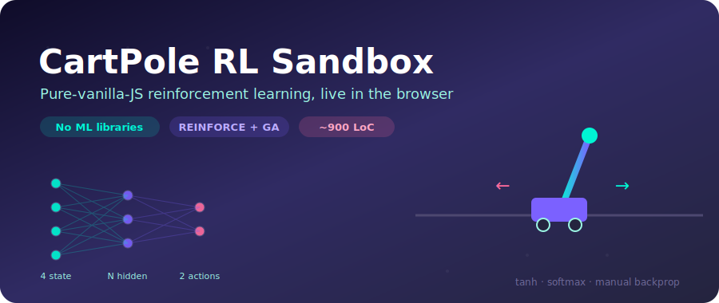
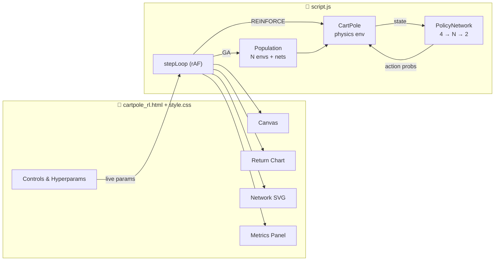
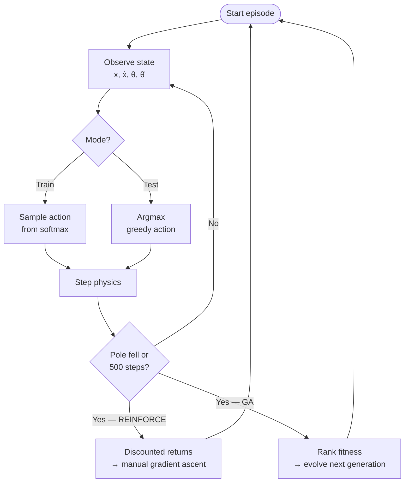

# 🚀 CartPole RL Sandbox

**A from-scratch reinforcement-learning playground that runs entirely in your browser — zero ML dependencies.**

---

## 🗺️ At a Glance

| | |
|---|---|
| 🎮 **Environment** | Classic CartPole physics — balance a pole on a moving cart |
| 🧠 **Brain** | Hand-rolled neural net: `4 → N → 2`, tanh + softmax, manual backprop |
| 🔀 **Two algorithms** | **REINFORCE** (policy gradient) and **Genetic Algorithm** (neuroevolution) |
| 🎨 **UI** | Dark glassmorphism dashboard with 4 live visualizations |
| 📦 **Stack** | 3 files · pure vanilla JS · no npm, no bundler, no TensorFlow |
| ▶️ **Run** | Open `cartpole_rl.html` in a browser — that's it |

---

## 🧩 Architecture

---

## 🔁 How Learning Works

The agent earns **+1 per timestep** the pole stays upright. An episode ends when the cart drifts past ±2.4 units, the pole tips past 12°, or 500 steps elapse.

---

## 🌟 Features

- **🎮 Pure Vanilla JS** — the environment, network, *and* gradients are written by hand. No TensorFlow.js, no ONNX.
- **🧠 Live Network Visualization** — watch hidden-layer weights shift and recolor in real time as the agent learns.
- **🎯 Action Confidence** — the policy's left/right probabilities update continuously from the current prediction.
- **📈 Performance Tracking** — an auto-updating chart of episode returns (or best fitness in GA mode).
- **🧬 Two Training Modes** — switch between gradient-based REINFORCE and population-based neuroevolution at runtime.
- **🧪 Test Mode** — flip off exploration to watch pure greedy inference (REINFORCE only).
- **💾 Save & Load** — export trained weights to a `.json` file and reload them later. A pre-trained `cartpole_model.json` is included.

---

## 🕹️ Usage

Open `cartpole_rl.html` in any modern browser. No install step.

| Control | What it does |
|---|---|
| **Start / Pause** | Run or halt the simulation loop |
| **Algorithm** | Choose REINFORCE or Genetic Algorithm |
| **Test Mode** | Toggle exploration off (greedy inference) — REINFORCE only |
| **Simulation Speed** | Steps per frame — crank it up to train faster |
| **Learning Rate / Gamma / Hidden Nodes** | Live REINFORCE hyperparameters |
| **Population / Mutation σ** | Live GA hyperparameters |
| **Apply Params / Reset** | Restart the environment with new settings |

> 💡 All hyperparameters are **live** — they're read each frame (or each generation), so you can tune mid-training.

---

## 🧬 The Genetic Algorithm hook

`evolve(networks, fitnesses, popSize, sigma)` in `script.js` is an intentionally open **TODO**. The default placeholder applies mutation with no selection pressure, so it doesn't learn — wiring in selection, elitism, and crossover is the exercise. Helpers `mutate(net, sigma)` and `cloneNetwork(net)` are provided.

---

## 🚀 Future Upgrades

1. **Stronger algorithms** — DQN with experience replay, or PPO for faster, more stable convergence.
2. **More environments** — MountainCar 🏔️, Pendulum ⏱️, LunarLander 🌖 (the `env`/`policy` split already supports this).
3. **Interactive perturbations** — drag or flick the pole mid-balance to stress-test the learned policy.
4. **Finish the GA** — implement real selection and crossover in `evolve(...)`.

---

*Built with ❤️ and Vanilla JavaScript.*

